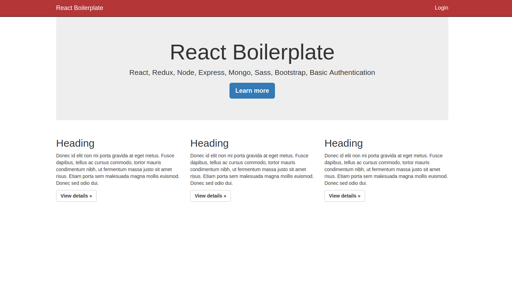
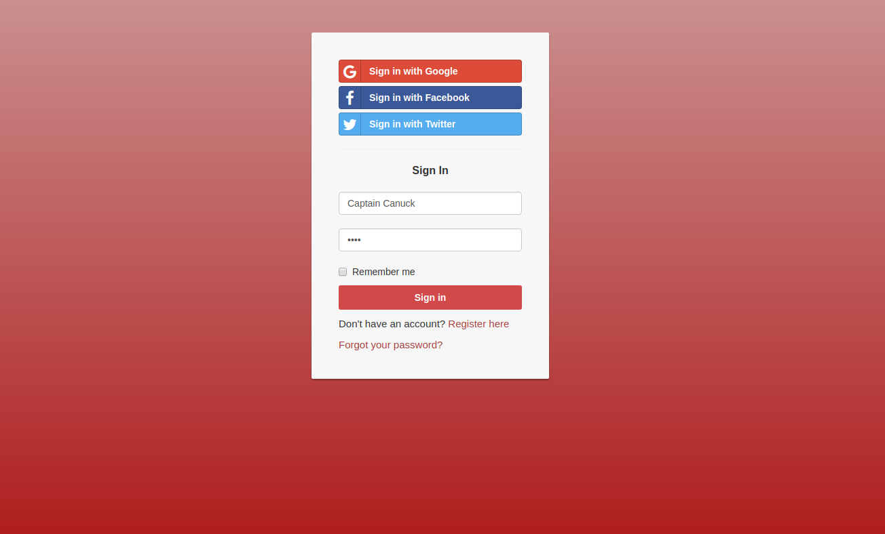
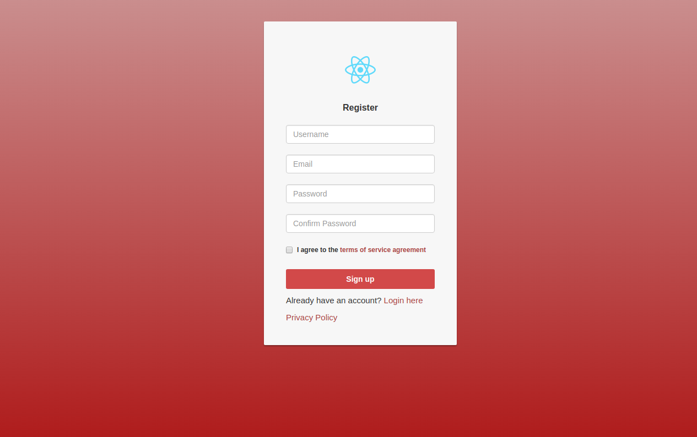

# react-boilerplate

React Boilerplate with Authentication

<a href="https://github.com/hutchgrant/react-boilerplate/raw/master/screenshots/screen_home.png"></a>
<a href="https://github.com/hutchgrant/react-boilerplate/raw/master/screenshots/screen_login.png"></a>
<a href="https://github.com/hutchgrant/react-boilerplate/raw/master/screenshots/screen_register.png"></a>

## Setup

You'll need Node, npm, mongodb.

If you want to use social media signin, you'll need API credentials from [Google+](https://console.developers.google.com/), [Twitter](https://apps.twitter.com/), [Facebook](https://developers.facebook.com/).

Note: With Twitter's API, you need to ensure your application has permissions set to request email addresses

You'll also need to sign up for [Google Recaptcha](http://www.google.com/recaptcha/admin) to get API keys.

```
git clone https://github.com/hutchgrant/react-boilerplate.git
cd ./react-boilerplate
npm install && npm install --prefix client
```

Add your Google Recaptcha site key to ./client/.env

```
REACT_APP_GOOGLE_RECAPTCHA_SITE_KEY=YourGoogleSiteKey
```

### Development

Edit ./config/dev.js to include your development API keys

```
mongoURI: '',
cookieKey: '',
sessionKey: '',
tokenSecret: '',
googleRecaptchaSecret: '',
googleClientId: '',
googleClientSecret: '',
facebookClientId: '',
facebookClientSecret: '',
twitterConsumerId: '',
twitterConsumerSecret: '',
redirectDomain: 'http://localhost:3000'
```

launch the server and client with monitors

```
npm run dev
```

### Production

set the following environment variables on your host with your production API keys:

```
MONGO_URI=''
COOKIE_KEY=''
SESSION_KEY=''
TOKEN_SECRET=''
GOOGLE_RECAPTCHA_SECRET='',
GOOGLE_CLIENT_ID=''
GOOGLE_CLIENT_SECRET=''
FACEBOOK_CLIENT_ID=''
FACEBOOK_CLIENT_SECRET=''
TWITTER_CONSUMER_ID=''
TWITTER_CONSUMER_SECRET=''
REDIRECT_DOMAIN='https://yoursite.com'
```

Build client:

```
npm run build --prefix client
```

## License

react-boilerplate is available under the [MIT License](https://github.com/hutchgrant/react-boilerplate/blob/master/LICENSE).

## Contributing

All contributions will be placed under the same MIT license, contributers must agree to that license.
For more information see [contributing](https://github.com/hutchgrant/react-boilerplate/blob/master/CONTRIBUTING.md).

## Author

**Grant Hutchinson (hutchgrant)**
