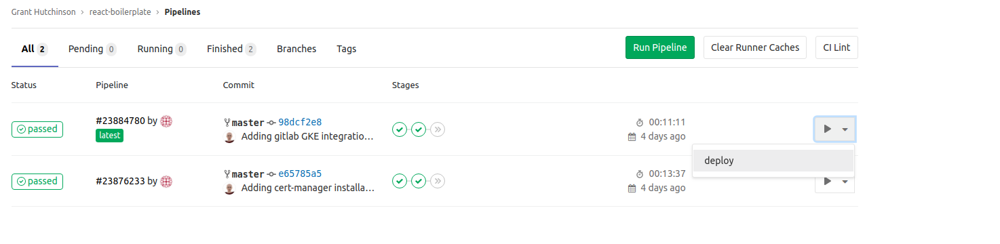
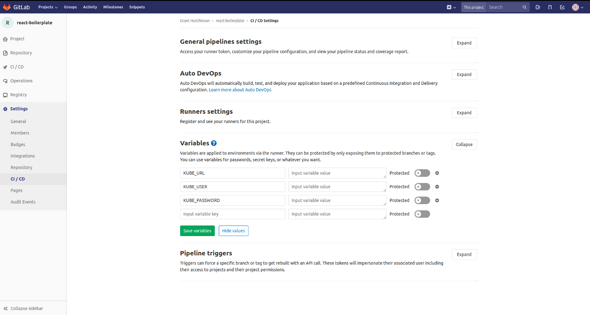
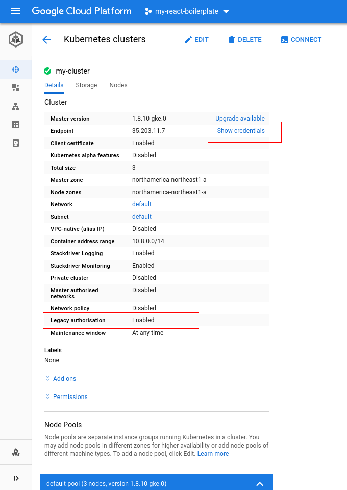
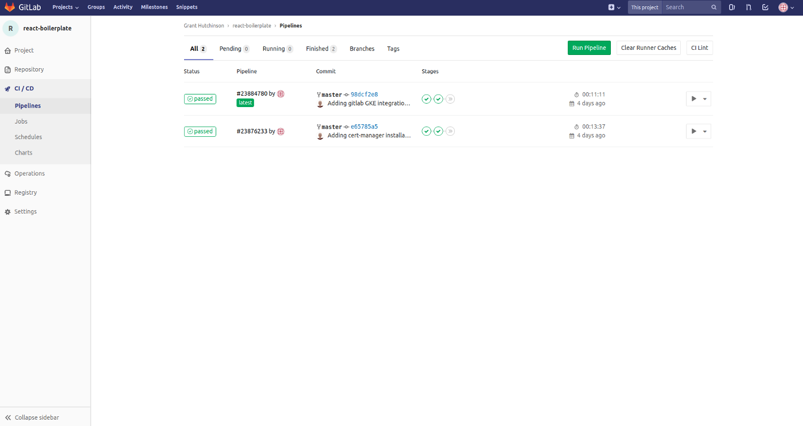
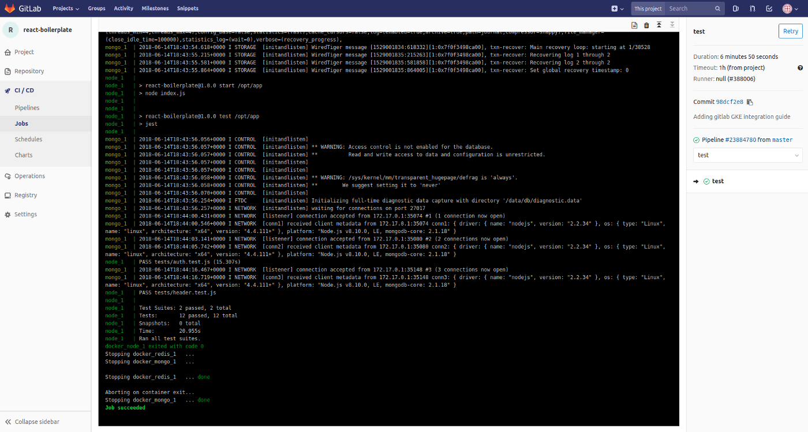
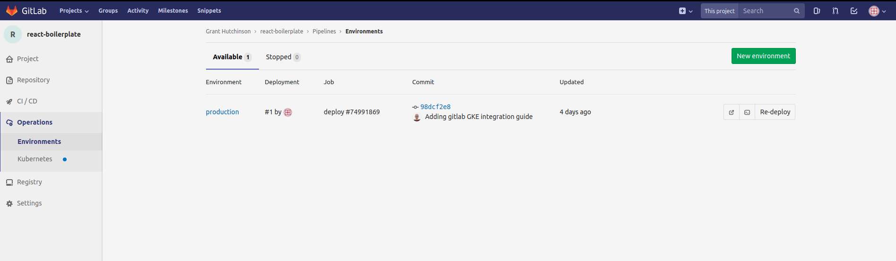

# Gitlab CI/CD Guide

[Official getting start with Gitlab CI/CD](https://docs.gitlab.com/ee/ci/quick_start/)
[Official Configuration of your jobs with .gitlab-ci.yml](https://docs.gitlab.com/ee/ci/yaml/)

## Basic Docker Pipeline

A pipeline is a series of automated jobs that are seperated into multiple, pre-defined, stages. For this example we will use docker to build, test, and deploy. We'll be utilizing the exposed docker from a node of our kubernetes cluster. See [Gitlab Integration Guide](https://github.com/hutchgrant/react-boilerplate/blob/master/docs/k8s-gitlab-integration-guide.md) for how to setup your docker runner on your kubernetes cluster.

Create a new .gitlab-ci.yml file in the root of your project repository.

## image and before_script

Set the docker image this pipeline will run in, since we're using docker we'll utilize the docker:latest image but you could create or use some other custom image for your pipeline. In our example, we're creating an environment variable using the repository's npm package version which we'll use later for tagging our image. We're also logging into gitlab's docker registry so that we can push/pull docker images from our gitlab repository. These steps are run before each job.

```yml
image: docker:latest

before_script:
  - export PACKAGE_VERSION=$(grep '"version":' package.json | cut -d\" -f4)
  - docker login -u "$CI_REGISTRY_USER" -p "$CI_REGISTRY_PASSWORD" $CI_REGISTRY
```

## Stages

You can define multiple stages which are executed in order of their placement. Jobs within each stage run in parallel.

```yml
stages:
  - build
  - test
  - deploy
```

## Scripts

Execute shell commands via the script keyword. In this example job, we're building the new docker image and tagging it with testing which will be an internal tag we'll use in the next stage.

```yml
build:
  stage: build
  script:
    - docker build -t $CI_REGISTRY_IMAGE:$PACKAGE_VERSION .
    - docker tag $CI_REGISTRY_IMAGE:$PACKAGE_VERSION $CI_REGISTRY_IMAGE/testing:latest
```

## Environment

When we're deploying to a specific environment and we want to track each of these deployments we can do so using environment. This enables us to rollback a deployment if need be or simply review deployment history for debugging etc.

```yml
deploy:
  stage: deploy
  environment:
    name: production
    url: https://hutchdev.ca
```

## When

If we want a stage to execute conditionally, we use the when keyword. For example, for manual approval before beginning a stage.

```yml
deploy:
  stage: deploy
  environment:
    name: production
    url: https://hutchdev.ca
  when: manual
```

When the pipeline reaches this job, it will stop and await for your approval



## Testing

In order to test our example image there are several prerequisites. We'll need mongodb and redis, as well as several environment variables. Starting and stopping these services can be handled by using docker-compose, which also doubles if you want to test in alternative environments. The following script installs docker-compose and forces the entire testing stack of containers to recreate each time its run. Also we force it to give an exit code when the test ends.

```yml
test:
  stage: test
  script:
    - apk add --update py-pip
    - pip install docker-compose
    - docker-compose -f ./config/docker/docker-compose.testing.yml up --force-recreate --exit-code-from node
```

If you're following our example, the ./config/docker/docker-compose.testing.yml needs to be edited with your registry.gitlab.com image.

```yml
version: '3.1'

services:
  redis:
    image: redis:alpine
    volumes:
      - data-redis:/data
  mongo:
    image: mongo
    volumes:
      - data-mongo:/data/db
  node:
    image: registry.gitlab.com/hutchgrant/react-boilerplate/testing:latest
    command: bash -c "npm run start & sleep 3 & npm test"
    ports:
      - "3000:3000"
    env_file:
      - ../shared.env
      - ../ci.env
    environment:
      - NODE_ENV=ci
      - PORT=3000
      - NODE_CONTAINER_STACK=true
    depends_on:
      - mongo
      - redis
volumes:
    data-mongo:
    data-redis:
```

If this test succeeds, it will continue to the next stage. If not, it will throw an error and force the end of the pipeline.

## Deploying to kubernetes

In order to deploy to kubernetes, we need a few things. For one, we need kubectl which can be quickly downloaded. An alternative might be to install kubectl on your runner's node and then expose it to the runner. Second, kubectl needs your cluster credentials(KUBE_URL, KUBE_USER, KUBE_PASSWORD). Last, we need the name of the new image we have just built and tested, as well as the cluster name and namespace we're deploying to.

To set the cluster credentials in gitlab, go to your Settings -> CI/CD and expand the "Variables" section.  


A reminder, your cluster URL can found with:

```bash
kubectl cluster-info
```

Your user and password credentials can be obtained within the Google Cloud Console:



Our example deploy stage uses the name 'my-cluster' and namespace 'default', we're setting the image of boilerplate-deployment resource to our newly built image. It will then create a new pod which will pull our new docker image from the gitlab registry.

```yml
deploy:
  stage: deploy
  environment:
    name: production
    url: https://hutchdev.ca
  when: manual
  script:
    - docker tag $CI_REGISTRY_IMAGE:$PACKAGE_VERSION $CI_REGISTRY_IMAGE:latest
    - docker push $CI_REGISTRY_IMAGE:latest
    - docker push $CI_REGISTRY_IMAGE:$PACKAGE_VERSION
    - apk add --no-cache curl
    - curl -LO https://storage.googleapis.com/kubernetes-release/release/$(curl -s https://storage.googleapis.com/kubernetes-release/release/stable.txt)/bin/linux/amd64/kubectl
    - chmod +x ./kubectl
    - mv ./kubectl /usr/local/bin/kubectl
    - kubectl config set-cluster my-cluster --server="$KUBE_URL" --insecure-skip-tls-verify=true
    - kubectl config set-credentials admin --username="$KUBE_USER" --password="$KUBE_PASSWORD"
    - kubectl config set-context default --cluster=my-cluster --user=admin
    - kubectl config use-context default
    - kubectl set image deployment/boilerplate-deployment react-boilerplate=$CI_REGISTRY_IMAGE:$PACKAGE_VERSION -n default
```

## Add Private Registry to Cluster

Your cluster will also need to access your private gitlab registry. To do that, on your cluster create a secret with your gitlab credentials.

```bash
kubectl create secret docker-registry gitlab-registry --docker-server=registry.gitlab.com --docker-username=GITLAB_USER --docker-password=GITLAB_USER --docker-email=YOUR_EMAIL
```

Then add that to your default serviceaccount (or any other serviceaccount) with:

```bash
kubectl patch serviceaccount default -p '{"imagePullSecrets": [{"name": "gitlab-registry"}]}'
```

## Testing our pipeline

By default, each time we commit to our gitlab repository, gitlab-ci.yml will automatically be executed on our runner. You can view the pipeline jobs summary and logs by visiting your repository then click CI/CD -> pipelines.



Each job within the pipeline can then be selected to view the status, time, and logs.



## Environment history

View the deployment history to your production environment(in this example) by visiting your gitlab repository and then go to Operations -> Environments

From here you can re-deploy, rollback, view commit log.



Congratulations you have setup a basic gitlab CI/CD pipeline with a kubernetes cluster.
