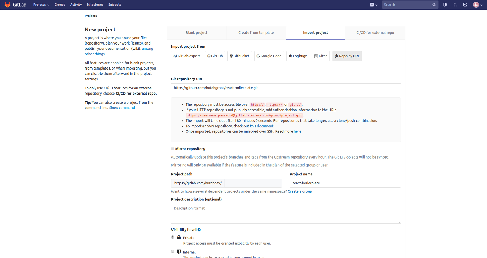
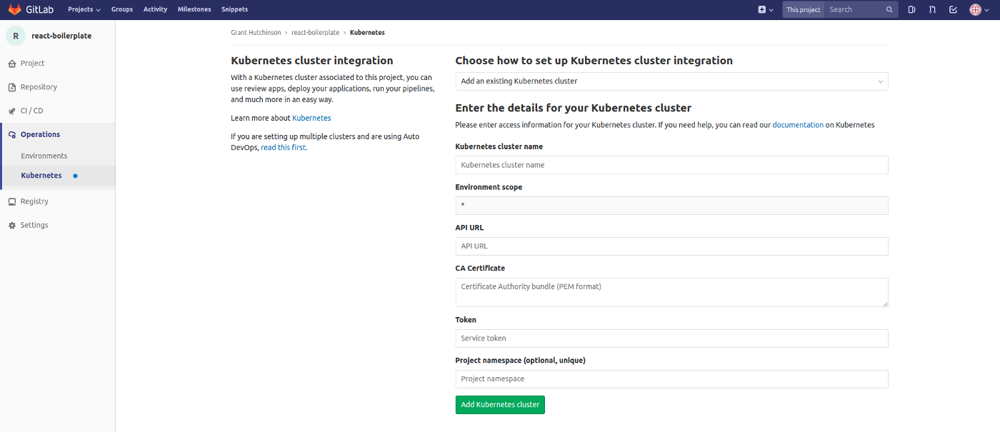
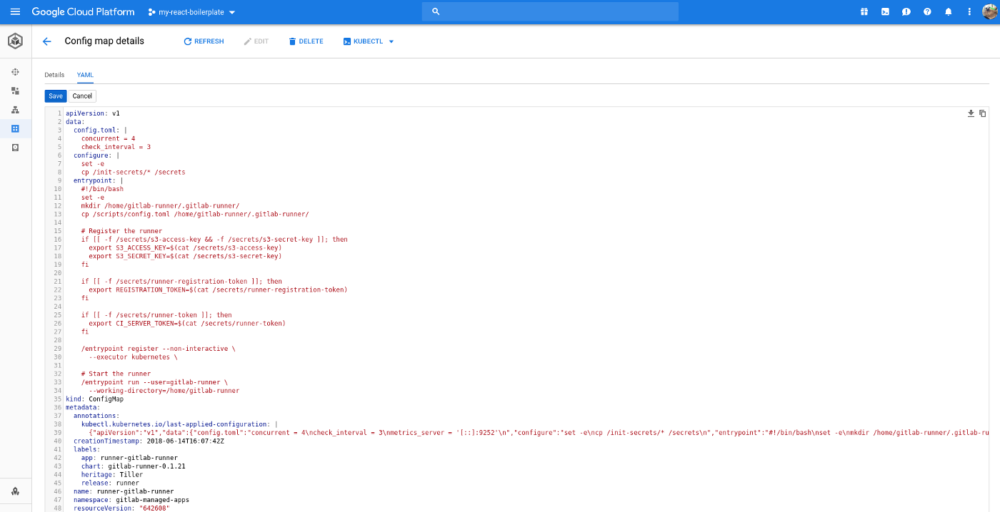

# Gitlab CI Runner on a GKE cluster

## Prerequisites

- Gitlab Account
- Google Kubernetes Engine Starter tutorial

## Import Boilerplate Project

- Create a new prvate gitlab project.
- Select the "import project" tab
- Select the Import project from "git Repo By URL" button.
- Set git repository URL to: https://github.com/hutchgrant/react-boilerplate.git
- Enter a Project name of react-boilerplate



On your newly created react-boilerplate project page click "Add Kubernetes cluster" button. It will be in the middle of your screen just above the last commit. Otherwise you can browse to it by going to the operations -> kubernetes menu link on the left side.

## Option 1: Create New GKE Cluster

You can automatically create a managed cluster using gitlab google kubernetes engine integration.

## Option 2: GKE Cluster

You can add an existing GKE cluster as well. The rest of this guide will focus on using an existing cluster



### Get certificate:

- open google cloud console kubernetes engine,
- edit the cluster defails and change Legacy Authorization to enabled, see [gitlab issue #29398](https://gitlab.com/gitlab-org/gitlab-ce/issues/29398).
- save
- click show credentials at the top of cluster details
- copy certificate
- Paste certificate into gitlab's kubernetes integration configuration


### Get default service account token:

```bash
kubectl get secrets | grep "default-token"
kubectl describe secret default-token-4gah3-whatever
```

Copy token and paste into gitlab's kubernetes integration configuration

### Get cluster API URL

```bash
kubectl cluster-info
```

Copy the Kubernetes master endpoint URL and paste into the Kubernetes API URL field in gitlab's integration configuration.

### Get cluster name

```bash
gcloud container clusters list
```

Copy the cluster name and paste into gitlab's kubernetes integration configuration form.

## Install Cluster Applications

### Install Helm

Click "install" next to helm in the runner options to install Helm kubernetes application package manager.

### Install gitlab runner

Click "install" next to gitlab runner in the runner options.

## Configure Runner

```bash
# Get the gitlab-runner pod:
kubectl get pods -n gitlab-managed-apps

# Execute bash on the pod
kubectl exec -it runner-gitlab-runner-7578d7b74b-9gjl9 -n gitlab-managed-apps bash

# Open your gitlab-runner configuration file
vi /home/gitlab-runner/.gitlab-runner/config.toml
```

First, we want to expose the host node's docker to the gitlab-runner with:

```bash
    [[runners.kubernetes.volumes.host_path]]
      name = "docker"
      mount_path = "/var/run/docker.sock"
```

Second, with the boilerplate project pipeline, we're building from a dockerfile and we want to access that docker image, at different stages, at different times. To do this, we need to force the gitlab-runner to use a specific node in your cluster, as different stages will launch different pods and your pods could end up launching on a different node and thus won't have access to docker images built on other nodes. This can be done from your gitlab-ci configuration use the [node-selector](https://gitlab.com/gitlab-org/gitlab-runner/blob/master/docs/configuration/advanced-configuration.md#the-runnerskubernetes-section) section.

```bash
    [runners.kubernetes.node_selector]
      "kubernetes.io/hostname" = "gke-my-cluster-default-pool-13cce75b-61dm"
```

the "kubernetes.io/hostname" is the label for the name of the kubernetes node you selected. If you've been following along, we created a 3 node cluster, choose 1 node to be your gitlab-runner node by running:

```bash
kubectl get nodes
```

our final config.toml configuration looks something like this:

```bash
metrics_server = "[::]:9252"
concurrent = 4
check_interval = 3

[[runners]]
  name = "runner-gitlab-runner-skfhk3kdf9adu1"
  url = "https://gitlab.com/"
  token = "YOUR_TOKEN"
  executor = "kubernetes"
  [runners.cache]
  [runners.kubernetes]
    host = ""
    bearer_token_overwrite_allowed = false
    image = "ubuntu:16.04"
    namespace = "gitlab-managed-apps"
    namespace_overwrite_allowed = ""
    privileged = true
    service_account_overwrite_allowed = ""
    [runners.kubernetes.node_selector]
      "kubernetes.io/hostname" = "gke-my-cluster-default-pool-13cce75b-61dm"
    [[runners.kubernetes.volumes.host_path]]
      name = "docker"
      mount_path = "/var/run/docker.sock"
```

Now you can run docker in your pipeline on a specific node of your cluster.

Copy the contents of your config.toml we're going to use it again.

## Edit ConfigMap

One problem here, the config.toml will not persist if the gitlab-runner deployment restarts for whatever reason. Solution as per [gitlab runner's kubernetes documentation](https://docs.gitlab.com/runner/install/kubernetes.html):

"_A recommended approach to this is to create a ConfigMap in Kubernetes such as the following:_"

Since we already installed the runner via gitlab's integration pages, it would make sense to simply modify the existing ConfigMap resource so that gitlab already installed for us.

Edit the runner-gitlab-runner ConfigMap resource installed by gitlab:

### Option 1:

```bash
kubectl edit ConfigMap runner-gitlab-runner -n gitlab-managed-apps
```

### Option 2:

go to https://console.cloud.google.com/kubernetes/config with your project selected at the top. Look for and select a configMap titled "runner-gitlab-runner". Then hit 'Edit' at the top.



## Amend ConfigMap

You need to modify the data -> config.toml stanza so it looks like the following(except with your config.toml, copy it from the step above):

```bash
data:
  config.toml: |
    metrics_server = "[::]:9252"
    concurrent = 4
    check_interval = 3

    [[runners]]
      name = "runner-gitlab-runner-7578d7b74b-9gjl9"
      url = "https://gitlab.com/"
      token = "YOUR_TOKEN"
      executor = "kubernetes"
      [runners.cache]
      [runners.kubernetes]
        host = ""
        bearer_token_overwrite_allowed = false
        image = "ubuntu:16.04"
        namespace = "gitlab-managed-apps"
        namespace_overwrite_allowed = ""
        privileged = true
        service_account_overwrite_allowed = ""
        [runners.kubernetes.node_selector]
          "kubernetes.io/hostname" = "gke-my-cluster-default-pool-13cce75b-61dm"
        [[runners.kubernetes.volumes.host_path]]
          name = "docker"
          mount_path = "/var/run/docker.sock"
```

One last change before you save it, you also need to to comment out:

```bash
    # /entrypoint register --non-interactive \
    #  --executor kubernetes \
```

Save it. You can test by deleting whatever current gitlab-runner pod is, double check that it is restarted again successfully, execute bash on the pod again and check the /home/gitlab-runner/.gitlab-runner/config.toml to see that your preferred configuration is present by default upon pod creation.

Congratulations you have successfully added and configured a new gitlab-runner with a kubernetes executor, exposed docker, node-selector, as well as made sure your configuration will stay the same regardless of whether the pod is restarted.

See the Gitlab CI guide(coming soon) for a tutorial in creating and using a devops pipeline with your new Gitlab Runner running in your kubernetes cluster.
