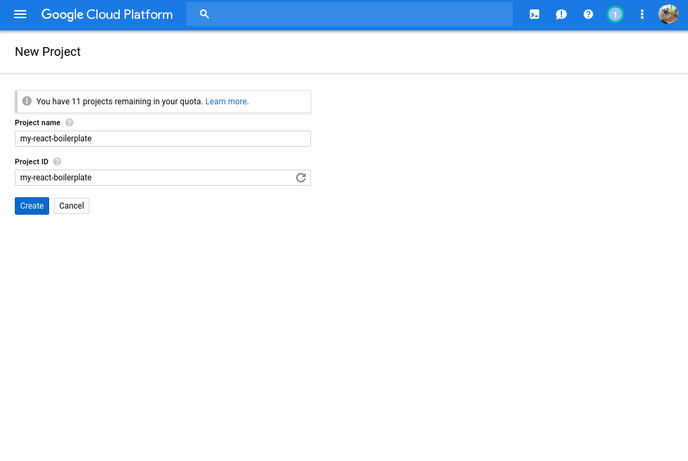
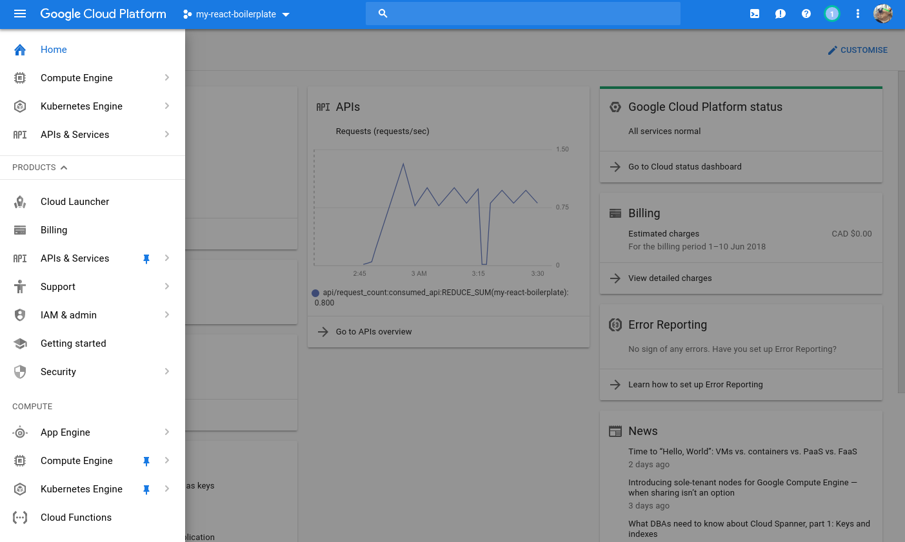
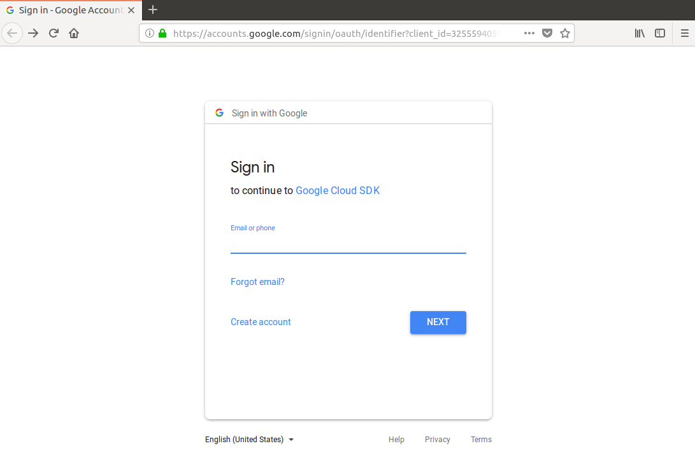

# Google Cloud Starter Tutorial

## Prerequisites

- Ubuntu 16.04 specifically for this tutorial but you could do this on Windows, Mac, or any other Linux Distro.

- Google Account

## Register for Google Cloud

- Sign in to https://console.cloud.google.com
- Agree to the Terms of Service
- Register for free, 12 month, $300 trial.

## Create a Google Project

[Create a project](https://console.cloud.google.com/projectcreate) or use an existing project from the top left dropdown of your google cloud console dashboard.



This can take a few minutes to get completely created. Once done, you can switch to the project at the top of your dashboard. If you click the menu button in the top left you'll be presented with all google services associated with your cloud account.

You can pin your preferred services to the top of the menu, for ease of use, by selecting the pin icon next to each service you want to use. You'll want to pin the Compute Engine(GCE), Kubernetes Engine(GKE), and APIs & Servies to the top as those are the services we will be using.



## Install Cloud SDK

On your local Ubuntu machine open a terminal and run the following:

```bash
# Create environment variable for correct distribution
export CLOUD_SDK_REPO="cloud-sdk-$(lsb_release -c -s)"

# Add the Cloud SDK distribution URI as a package source
echo "deb http://packages.cloud.google.com/apt $CLOUD_SDK_REPO main" | sudo tee -a /etc/apt/sources.list.d/google-cloud-sdk.list

# Import the Google Cloud Platform public key
curl https://packages.cloud.google.com/apt/doc/apt-key.gpg | sudo apt-key add -

# Update the package list and install the Cloud SDK
sudo apt-get update && sudo apt-get install google-cloud-sdk
```

## Initialize Cloud SDK

Authorize your computer with your google cloud account and initialize.

```bash
gcloud init
```

A browser will automatically open and you will be presented with a google login screen. After you login it will ask you to grant Google Cloud SDK permission to view and manage your cloud applications. Click Allow.



Success! you're authenticated. Exit that browser and open the terminal you were previously using which has gcloud init running. You'll see gcloud presents you with a list of projects from which you can select to work on. Or it gives you the ability to create a new project. Since we already created a project selected the number next to your my-react-boilerplate project and hit enter.

```bash
Your current project has been set to: [my-react-boilerplate].

Do you want to configure a default Compute Region and Zone? (Y/n)?  
```

type 'Y' and hit Enter. Pick a region to host your project in. I suggest something close to your location. For this tutorial I'm using northamerica-northeast1-a. Enter the number for the region and hit enter.

_Note: You can also switch between projects using:_

```bash
gcloud config set project yourproject_id
```

You can read the [official gcloud documentation](https://cloud.google.com/sdk/gcloud/) for more information.

Congratulations you have successfully created and configured a new project with Google Cloud.
