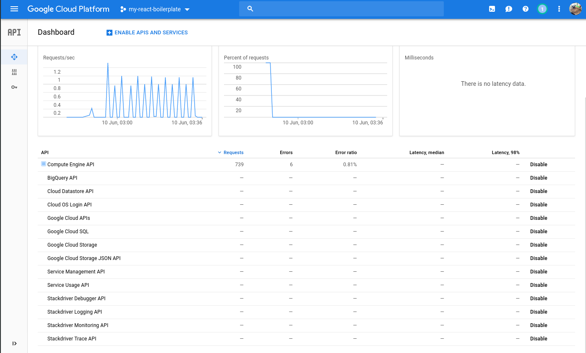
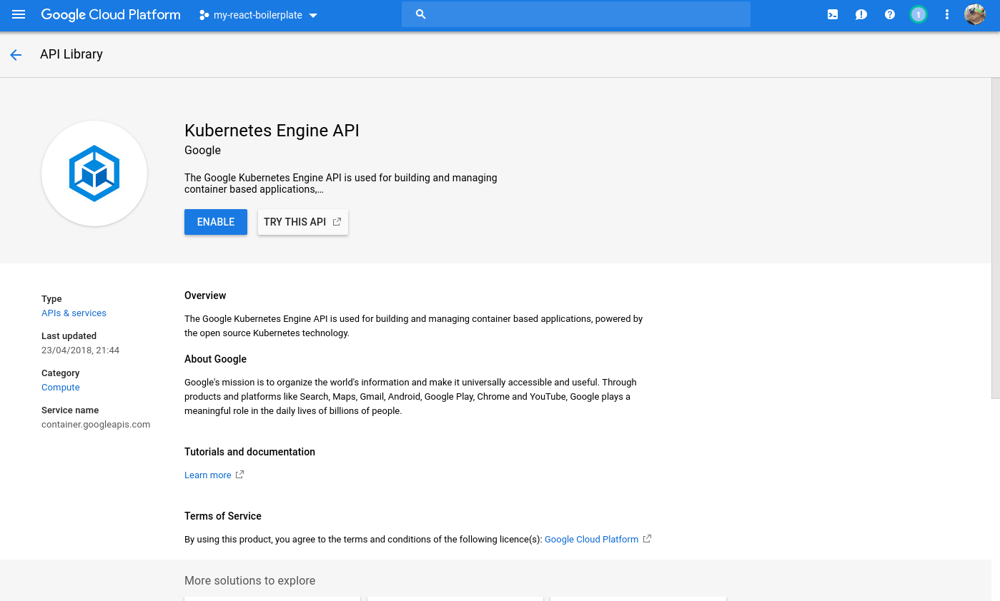
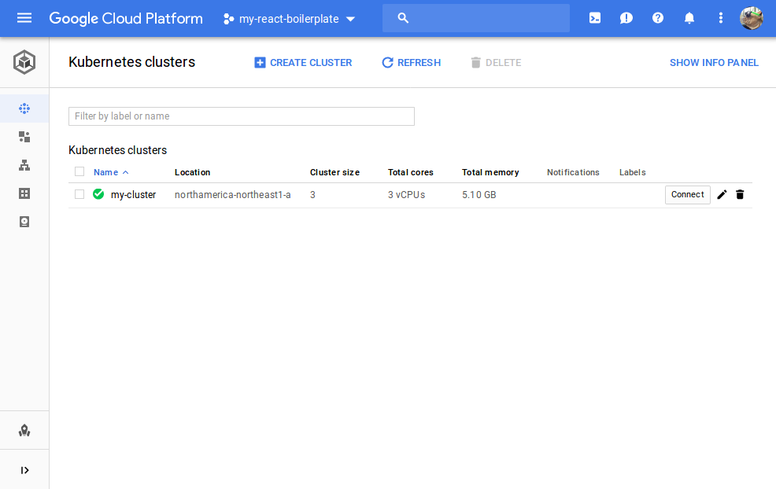

# Google Kubernetes Engine Starter Tutorial

## Prerequisites

- [Google Cloud Starter Tutorial](https://github.com/hutchgrant/react-boilerplate/blob/master/docs/k8s-google-cloud-starter-tutorial.md)
- Ubuntu 16.04 but you could use any OS with different commands

## Install kubectl

Follow the [official installation instructions](https://kubernetes.io/docs/tasks/tools/install-kubectl/) for the kubernetes command line tool kubectl. This tool is used for management of any kubernetes cluster.

For Ubuntu 16.04 install via apt:

```bash
apt-get update && apt-get install -y apt-transport-https
curl -s https://packages.cloud.google.com/apt/doc/apt-key.gpg | apt-key add -
cat <<EOF >/etc/apt/sources.list.d/kubernetes.list
deb http://apt.kubernetes.io/ kubernetes-xenial main
EOF
apt-get update
apt-get install -y kubectl
```

Or you can install via snap:

```bash
sudo snap install kubectl --classic
```

To verify install:

```bash
kubectl version
```

## Enable Kubernetes API

Back in your [Google Cloud Console](https://console.cloud.google.com), select the top-left menu and click "APIs & Services". As you can see from the following page, this is all the APIs and keys assosciated with this google cloud project. By default, you already have a number of cloud APIs enabled.



If you hover your mouse all the way to the left of the screen an APIs & Service Menu will appear. Click "Library". Or Click "ENABLE APIS AND SERVICES" at the top.

From the API Library page, search "kubernetes". You will be presented with one result "Kubernetes Engine API". Click it, then on the following page click "Enable"



## Create Kubernetes Cluster

Now that the project is configured, kubectl is installed, kubernetes API is enabled, it's time to create your cluster. First you may want to decide how many nodes you want and how big they should be(machine-type). For the purpose of this tutorial, I'm going to use 3 g1-small nodes.

_You can calculate the price vs size and number of nodes via [Google's Cloud Pricing Calculator](https://cloud.google.com/products/calculator/)._

Back in your terminal window run:

```bash
gcloud container clusters create my-cluster --num-nodes 3 --machine-type g1-small
```

This will provision 3 new virtual private servers on the Google Computer Engine all networked in 1 kubernetes cluster. It will take a few minutes to create. You can view and manage your new cluster [back in the console](https://console.cloud.google.com/kubernetes/) by clicking "Kubernetes Engine" from the top-left menu.



Also gcloud has automatically setup your kubectl kubeconfig. Now you can manage your cluster via kubectl in your terminal. To see your new nodes run:

```bash
kubectl get nodes
```

To see the default pods running on your cluster:

```bash
kubectl get pods --all-namespaces
```

Congratulations you have successfully created a new cluster on Google Kubernetes Engine.
