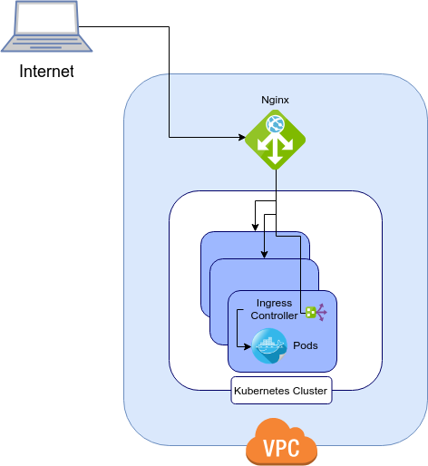

# Nginx Proxy and Ingress Controller

[Official Nginx Ingress Controller Repository](https://github.com/kubernetes/ingress-nginx)

This is an alternative method of routing traffic instead of using the built in Load Balancer created by google. This method in the form described here requires some manual involvement to scale. I recommend this in low budget clusters but if you're fine with 20$ a month for a load balancer then go with Google's Load Balancer instead.

In this example, we're routing external traffic to a nginx proxy running within your virtual private cloud network. The nginx proxy will then route the traffic to your each of your internal cluster nodes' ingress controller which will then forward traffic to your services and then pods.



## Install nginx-ingress

```bash
kubectl -f config/kubernetes/nginx-ingress/nginx.yaml
kubectl -f config/kubernetes/nginx-ingress/nginx-service.yaml
```

## Create Ingress for React-Boilerplate

You'll need a domain for this part, if you don't have one I suggest purchasing one at godaddy.com For this example we'll be using regular http. Checkout a cert-manager guide for how to modify this ingress for use https.

Edit the config/kubernetes/nginx-ingress/ingress.yaml template with your domain:

```ruby
apiVersion: extensions/v1beta1
kind: Ingress
metadata:
  name: boilerplate-map
  annotations:
    kubernetes.io/ingress.class: nginx
spec:
  rules:
  - host: hutchdev.ca
    http:
      paths:
      - path: /
        backend:
          serviceName: boilerplate-service
          servicePort: 80
  - host: www.hutchdev.ca
    http:
      paths:
        - path: /
          backend:
            serviceName: boilerplate-service
            servicePort: 80
```

Create the resources from this template:

```bash
kubectl apply -f config/kubernetes/nginx-ingress/ingress.yaml
```

## Test

Get the name of the ingress-controller pod

```sh
kubectl get pods -n ingress-nginx
```

Go into that pod

```shell
kubectl exec -it -n ingress-nginx nginx-ingress-controller-1575676611-fxkg8 bash
```

curl the address without host header or path:

```shell
root@nginx-ingress-controller-1575676611-fxkg8:/# curl localhost

default backend — 404
```

curl the address with header and path:

```shell
root@nginx-ingress-controller-1575676611-fxkg8:/# curl localhost/foo -H 'Host: hutchdev.ca
```

## Create External Nginx Proxy Instance

We'll use a small virtual private server running nginx to forward our external traffic. This machine is seperate than our cluster that we're using in place of the default Google Cloud Load Balancer.

```bash
gcloud compute instances create test-proxy \
> --image-project debian-cloud --image-family debian-9 \
> --machine-type f1-micro

Created [https://www.googleapis.com/compute/v1/projects/my-react-boilerplate/zones/northamerica-northeast1-a/instances/test-proxy].
NAME        ZONE                       MACHINE_TYPE  PREEMPTIBLE  INTERNAL_IP  EXTERNAL_IP    STATUS
test-proxy  northamerica-northeast1-a  f1-micro                   10.162.0.5   35.203.31.234  RUNNING
```

## Get Internal IP for all of your Cluster Nodes

We need the Internal IP of all your cluster nodes. This step is the reason many would avoid this method and intead opt for the google Load Balancer. Ideally, you could have an internal load balancer which automatically has access to all these node IPs.

For this example you need to copy these internal IPs we'll be adding these to our nginx proxy next.

```bash
gcloud compute instances list
NAME                                       ZONE                       MACHINE_TYPE  PREEMPTIBLE  INTERNAL_IP  EXTERNAL_IP    STATUS
gke-my-cluster-default-pool-f97fd3c8-2m14  northamerica-northeast1-a  g1-small                   10.162.0.4   35.203.0.26    RUNNING
gke-my-cluster-default-pool-f97fd3c8-dpqg  northamerica-northeast1-a  g1-small                   10.162.0.3   35.203.29.5    RUNNING
gke-my-cluster-default-pool-f97fd3c8-fklh  northamerica-northeast1-a  g1-small                   10.162.0.2   35.203.91.208  RUNNING
test-proxy                                 northamerica-northeast1-a  f1-micro                   10.162.0.5   35.203.95.73   RUNNING
```

## Install Nginx in New Instance

### SSH Into New Instance

```bash
gcloud compute ssh test-proxy
```

In the new test-proxy instance, run:

```bash
sudo apt-get install nginx
```

### Configure Nginx

In the /etc/nginx/nginx.conf file, comment out the include for the virtual host config, and move the conf.d include outside the ‘http’ section, like below:

```
##
    # Virtual Host Configs
    ##
#   include /etc/nginx/sites-enabled/*;
}
include /etc/nginx/conf.d/*.conf;
```

After you’ve done that, create a ingress-proxy.conf config file in the /etc/nginx/conf.d directory. Add the IP addresses of your backends along with the ports as shown in the example below.

```
stream {
  upstream backend_nodes {
    server 10.162.0.4:31001;
    server 10.162.0.3:31001;
    server 10.162.0.4:21001;
  }
upstream backend_nodes_ssl {
    server 10.162.0.4:32001;
    server 10.162.0.3:32001;
    server 10.162.0.2:32001;
  }
server {
    listen 80;
    proxy_pass backend_nodes;
  }
server {
    listen 443;
    proxy_pass backend_nodes_ssl;
  }
}
```

## Test External Proxy

Restart nginx:

```
sudo service nginx restart
```

curl request localhost

```
curl localhost
```

should show:

```
default backend — 404
```

curl request with headers and path

```
curl localhost -H 'Host: hutchdev.ca'
```

result:

```html
<!DOCTYPE html><html lang="en"><head><meta charset="utf-8"><meta name="viewport" content="width=device-width,initia
l-scale=1,shrink-to-fit=no"><meta name="theme-color" content="#000000"><link rel="manifest" href="/manifest.json"><
link rel="shortcut icon" href="/favicon.ico"><title>React Boilerplate</title><link href="/static/css/main.9ccc421a.
css" rel="stylesheet"></head><body><noscript>You need to enable JavaScript to run this app.</noscript><div id="root
"></div><script type="text/javascript" src="/static/js/main.b4380ac9.js"></script></body></html>
```

## Firewall

By default, incoming traffic to your nginx proxy(test-proxy) will be denied. In order to allow traffic on port 80 and 443 you can add firewall rules if they don't already exist. To check if the rules for these ports exists:

```bash
gcloud compute firewall-rules list
```

If port 80 and 443 aren't listed, you can do 1 of 2 things. You can go to console.cloud.google.com/compute click edit within the details of your test-proxy instance, checkmark 2 boxes "Allow Http" and "Allow Https" then save. Or you can do it programmatically with Google SDK by creating a new rule that uses a target tag of "http-server" and "https-server".

```bash
gcloud compute firewall-rules create allow-http --allow tcp:80 --target-tags=http-server
gcloud compute firewall-rules create allow-https --allow tcp:443 --target-tags=https-server
```

If doing it programmatically with Google's SDK, you can then tag your nginx test-proxy instance with "http-server" and "https-server" to make the firewall rule apply to that compute instance.

```bash
gcloud compute instances add-tags test-proxy --tags http-server,https-server
```

## Forward Domain

Ctrl+D exit the test-proxy. Go to your domain providers website, login, manage the domains DNS. Edit the domain A record to use the external IP of your 'test-proxy' virtual private server on the google compute engine. You can get that external IP again with:

```bash
gcloud compute instances list
```

Congratulations! Now you can visit your domain in your browser and you should see react-boilerplate.

From here, I suggest setting up SSL using cert-manager with certificate and issuer resources in your cluster.
